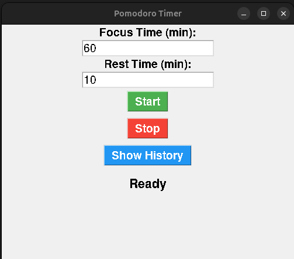

# ⏳ Pomodoro Timer App

A simple **Pomodoro Timer** built with Python logic and Qt5, featuring session tracking with SQLite and desktop notifications for Linux. 📅🔔

---

## 🚀 Features
- 🎯 Customizable **focus** and **break** times
- 📊 **Session history** stored using SQLite
- 🛑 **Start/Pause/Reset** functionality
- 🔔 **Desktop notifiactions** upon session completion
- 🖥️ Simple and intuitive **Qt5 GUI**

---

## 🛠️ Installation

### 🔧 Prerequisites
Ensure you have **Conda** installed. If not, install [Miniconda](https://docs.conda.io/en/latest/miniconda.html).

### 📥 Clone the Repository
```bash
git clone https://github.com/antoni-climent/Pomodify.git
cd Pomodify
```

### 📦 Install Dependencies
Run the setup script:
```bash
chmod +x install.sh
./install.sh
```
This will:
- Create a **Conda environment** 🐍
- Install required dependencies 📦
- Launch the Pomodoro app ⏳

Alternatively, install manually:
```bash
conda create -n pomodoro python=3.10
conda activate pomodoro
pip install -r requirements.txt
```

---

## ▶️ Usage
Run the application with:
```bash
conda activate pomodoro
python pomodoro.py
```

### 🎨 Interface Overview
- **Start**: Begin a Pomodoro session
- **Pause**: Pause the session
- **Restart**: Restarts the session and returns to focus time
- **Show History**: View past focus times

---

## 📜 Requirements
```txt
pysqlite3==0.5.4
PyQt5==5.15.11
PyQt5-Qt5==5.15.16
PyQt5_sip==12.17.0
```

---

## 📸 Screenshots
The Pomodoro Timer app looks like this:



---

Happy Focusing! 🎯

